# 📊 CIFAR-10 Classification Report

## 🧾 Overview

This assignment involves implementing and evaluating a series of deep learning models: **ANN, CNN, LeNet, AlexNet, VGG16, VGG19, ResNet50, and ResNet150**.  
These models were trained and tested on the **CIFAR-10** dataset to compare their performance in terms of classification accuracy, precision, recall, and F1-score.  

The report includes training-validation plots, confusion matrices, ROC curves, and a final comparison table.

---

## 📋 Model Comparison Table

| Model       | Parameters | Accuracy | Precision | Recall | F1 Score |
|-------------|------------|----------|-----------|--------|----------|
| ANN         | ...        | ...%     | ...       | ...    | ...      |
| CNN         | 338,506    | 52.65%   | 0.5846    | 0.5265 | 0.5054   |
| LeNet       | 62,006     | 56.00%   | 0.56      | 0.56   | 0.56     |
| AlexNet     | ...        | ...%     | ...       | ...    | ...      |
| VGG16       | 14,714,688 | 83.99%   | 0.8538    | 0.8399 | 0.8431   |
| VGG19       | 20,275,274 | 85.00%   | 0.86      | 0.85   | 0.85     |
| ResNet50    | 23,587,712 | 94.07%   | 0.9411    | 0.9407 | 0.9408   |
| ResNet150   | 59,199,050 | **86**%  | 0.86      | 0.86   | 0.86     |

> 📝 Note: There is a severe issue with the case of ResNet152, during training was unable to go beyond 87 % accuracy even after training for around 10 epochs. Need to check what exactly went wrong and what caused such a drastic difference from the expected accuracy.

---

## 🧠 Model-wise Evaluation

### ANN

<table>
<tr>
<td></td>
<td></td>
</tr>
<tr>
<td align="center"><b>Confusion Matrix</b></td>
<td align="center"><b>ROC Curve</b></td>
</tr>
</table>

---

### CNN

<table>
<tr>
<td>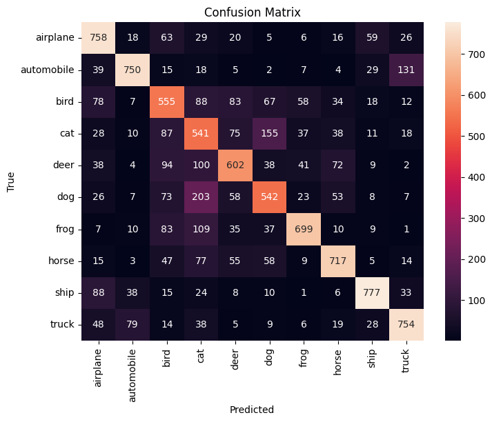</td>
<td>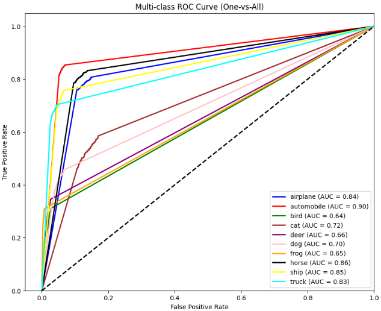</td>
</tr>
<tr>
<td align="center"><b>Confusion Matrix</b></td>
<td align="center"><b>ROC Curve</b></td>
</tr>
</table>

---

### LeNet

<table>
<tr>
<td></td>
<td></td>
</tr>
<tr>
<td align="center"><b>Confusion Matrix</b></td>
<td align="center"><b>ROC Curve</b></td>
</tr>
</table>

---

### AlexNet

<table>
<tr>
<td></td>
<td></td>
</tr>
<tr>
<td align="center"><b>Confusion Matrix</b></td>
<td align="center"><b>ROC Curve</b></td>
</tr>
</table>

---

### VGG16

<table>
<tr>
<td>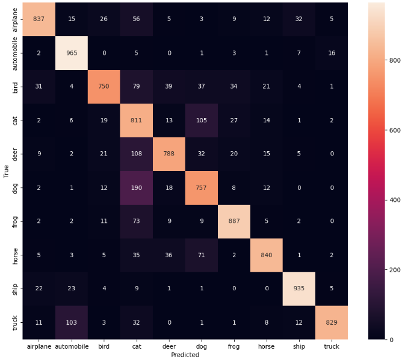</td>
<td>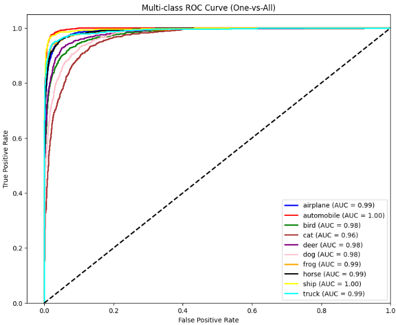</td>
</tr>
<tr>
<td align="center"><b>Confusion Matrix</b></td>
<td align="center"><b>ROC Curve</b></td>
</tr>
</table>

---

### VGG19

<table>
<tr>
<td></td>
<td></td>
</tr>
<tr>
<td align="center"><b>Confusion Matrix</b></td>
<td align="center"><b>ROC Curve</b></td>
</tr>
</table>

---

### ResNet50

<table>
<tr>
<td>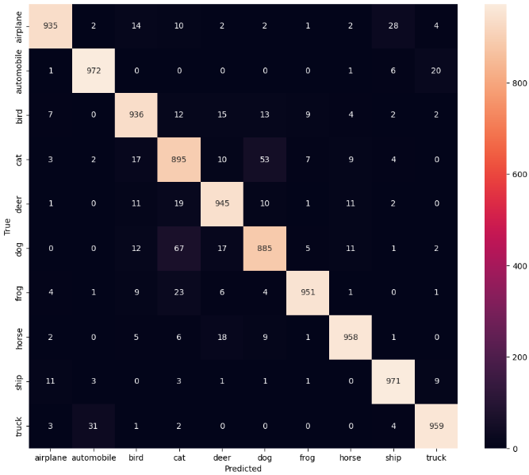</td>
<td>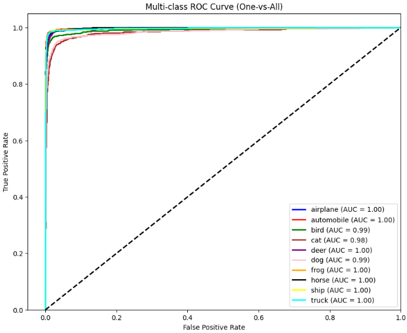</td>
</tr>
<tr>
<td align="center"><b>Confusion Matrix</b></td>
<td align="center"><b>ROC Curve</b></td>
</tr>
</table>

---

### ResNet150

<table>
<tr>
<td></td>
<td></td>
</tr>
<tr>
<td align="center"><b>Confusion Matrix</b></td>
<td align="center"><b>ROC Curve</b></td>
</tr>
</table>

---

## 📉 Training vs. Validation Loss Curves

| Model       | Loss Curve |
|-------------|------------|
| ANN         |  |
| CNN         | 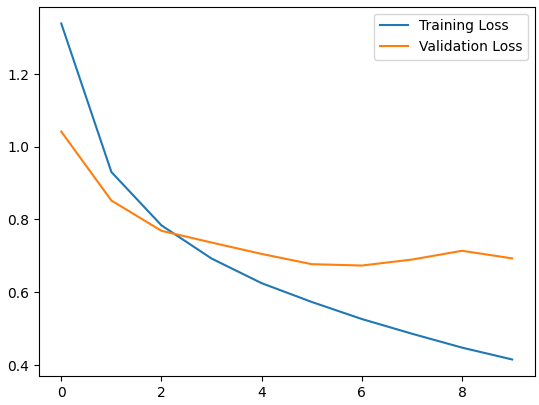 |
| LeNet       | 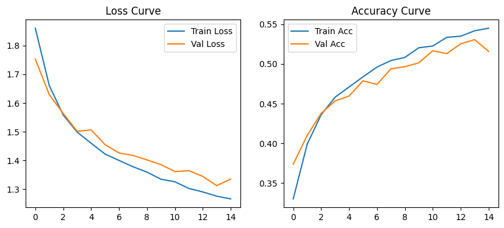 |
| AlexNet     |  |
| VGG16       | 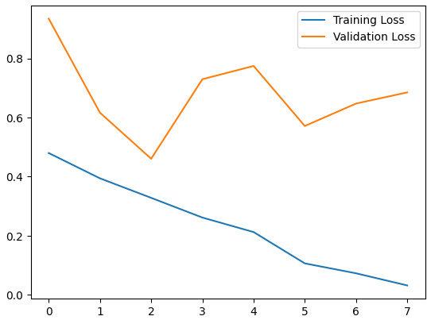 |
| VGG19       | 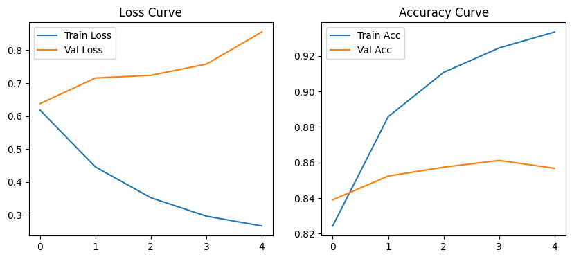 |
| ResNet50    | 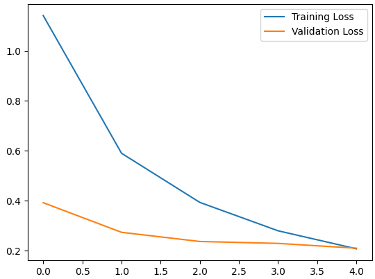 |
| ResNet150   | 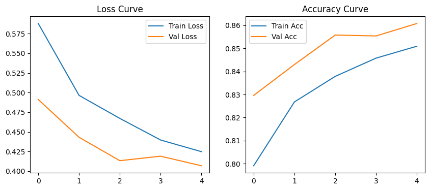 |

> 🧠 These plots help understand convergence behavior and overfitting across different model architectures.

